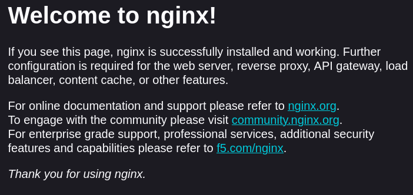
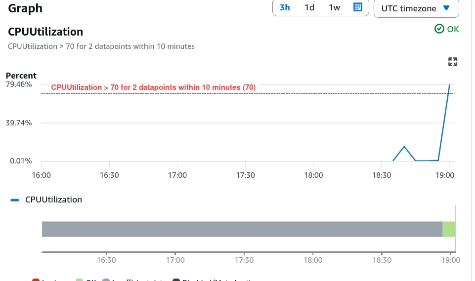
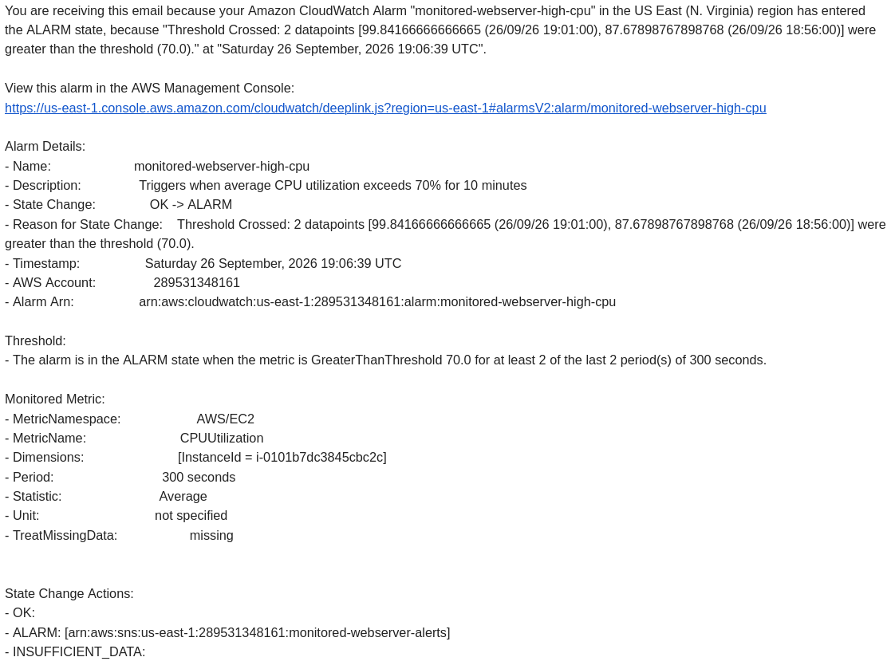

# aws-monitored-webserver

A fully automated AWS web server deployment: infrastructure defined entirely in Terraform, deployed through a GitHub Actions CI/CD pipeline with zero long-lived AWS credentials (OpenID Connect), and monitored with a CloudWatch alarm that emails on high CPU.

This started as a way to build cloud engineering projects instead of collecting more certifications — the goal was to actually build, break, and fix real infrastructure rather than follow a single tutorial end to end.

## Architecture

- **VPC** with a public subnet, internet gateway, and route table
- **Security group** allowing HTTP (80) and SSH (22)
- **EC2 instance** (Amazon Linux 2, t3.micro) running nginx, installed automatically via a `user_data` startup script
- **S3 bucket** storing Terraform's remote state, shared across machines
- **SNS topic** for alert delivery, with an email subscription
- **CloudWatch alarm** watching CPU utilization, wired to publish to the SNS topic when triggered

## How the pipeline works

Every change goes through a pull request rather than a manual `terraform apply`:

- **On a pull request:** the pipeline runs `terraform fmt`, `validate`, and `plan`, so the exact changes are visible before anything touches AWS.
- **On merge to `main`:** the pipeline runs `terraform apply` automatically.

Authentication from GitHub Actions to AWS uses **OIDC (OpenID Connect)** instead of stored AWS access keys. GitHub issues a short-lived, signed token describing the workflow run; AWS's IAM role trusts that token (scoped to this specific repository) and hands back temporary credentials. No long-lived secret ever sits in GitHub.

Branch protection on `main` requires a pull request and a passing plan before merging, so the review step can't be skipped — even by the repo owner.

## Prerequisites to reproduce this

- An AWS account with the CLI configured
- Terraform installed locally
- An S3 bucket created ahead of time for remote state (referenced in the `backend "s3"` block)
- A GitHub repository with:
  - An OIDC identity provider and IAM role configured to trust it (see `trust-policy.json` pattern)
  - A repository secret named `ALERT_EMAIL` holding the notification email address

## Screenshots

- Nginx welcome page served from the deployed instance
- 
- CloudWatch alarm graph showing a real CPU spike crossing the 70% threshold
-  
- The resulting alarm email
- 

## Things I learned

**Package manager assumptions don't transfer between distros.** I assumed Amazon Linux 2 used `dnf`, the same package manager as my Fedora desktop. The instance's `user_data` script failed silently on boot; reading the raw cloud-init log through the AWS console (EC2 → Instance → Get system log) showed `dnf: command not found`. Amazon Linux 2 uses `yum`.

**Some packages live behind `amazon-linux-extras`, not the default repos.** After fixing the package manager, `yum install nginx` still failed — the log showed nginx isn't in AL2's default repos at all, and pointed me directly to `amazon-linux-extras install nginx1` as the correct install path.

**Terraform state isn't shared across machines by default.** I do this project from both a desktop and a MacBook. Local state (`terraform.tfstate`) lives only on whichever machine ran `apply` — running `terraform plan` from the other machine would have shown a plan to recreate everything from scratch, since it had no record that anything existed. I fixed this by moving state into a versioned S3 bucket as a remote backend, so both machines (and the CI/CD pipeline) read and write the same state.

**IAM permissions have to be granted incrementally, and that's normal.** The GitHub Actions IAM role initially only had EC2 and S3 permissions, since that's all Phase 1/2 needed. Adding the SNS topic and CloudWatch alarm in Phase 3 immediately surfaced `AccessDenied` errors in the pipeline logs, naming the exact missing action (`SNS:CreateTopic`). Attaching the corresponding managed policy resolved it. This is a realistic, common pattern — least-privilege access grows with the infrastructure, rather than being fully guessed upfront.

**OIDC trust conditions can silently fail for reasons that have nothing to do with the policy syntax.** After OIDC setup looked correct on both sides (matching thumbprint, matching client ID, correctly scoped `sub` condition), authentication still failed with `Not authorized to perform sts:AssumeRoleWithWebIdentity`. Adding a debug step to print the actual JWT claims GitHub was sending revealed the cause: because my GitHub account or repository had been renamed at some point, GitHub includes the account/repo's immutable numeric ID alongside the name in the `sub` claim (e.g. `repo:user@12345/repo@67890:pull_request` instead of `repo:user/repo:pull_request`). The fix was widening the trust policy's wildcard pattern to match with or without that suffix.

**Secrets need different handling locally versus in a pipeline.** A Terraform variable's value can't live in a committed `.tf` file, but it also can't be supplied the same way in every environment. Locally, `terraform.tfvars` (gitignored) supplies it. In the pipeline, the same variable is populated from a GitHub Actions secret via a `TF_VAR_` prefixed environment variable — two different mechanisms solving the same "keep it out of Git" problem in the two places Terraform actually runs.

## Known limitations / what I'd change for production

- The GitHub Actions IAM role uses broad AWS-managed policies (`AmazonEC2FullAccess`, `AmazonS3FullAccess`, `AmazonSNSFullAccess`, `CloudWatchFullAccess`) rather than a narrow, custom least-privilege policy. Fine for a solo learning project; a production setup should scope this down to only the specific actions actually used.
- No Terraform state locking (e.g. a DynamoDB table). Safe here since applies are never run concurrently, but this would be a real risk with more than one contributor.
- SSH access relies on AWS EC2 Instance Connect rather than a dedicated key pair, since no `key_name` is configured on the instance.
- The EC2 instance's public IP is ephemeral and changes on every replacement; a production setup would likely use an Elastic IP or put the instance behind a load balancer with a stable DNS name.
